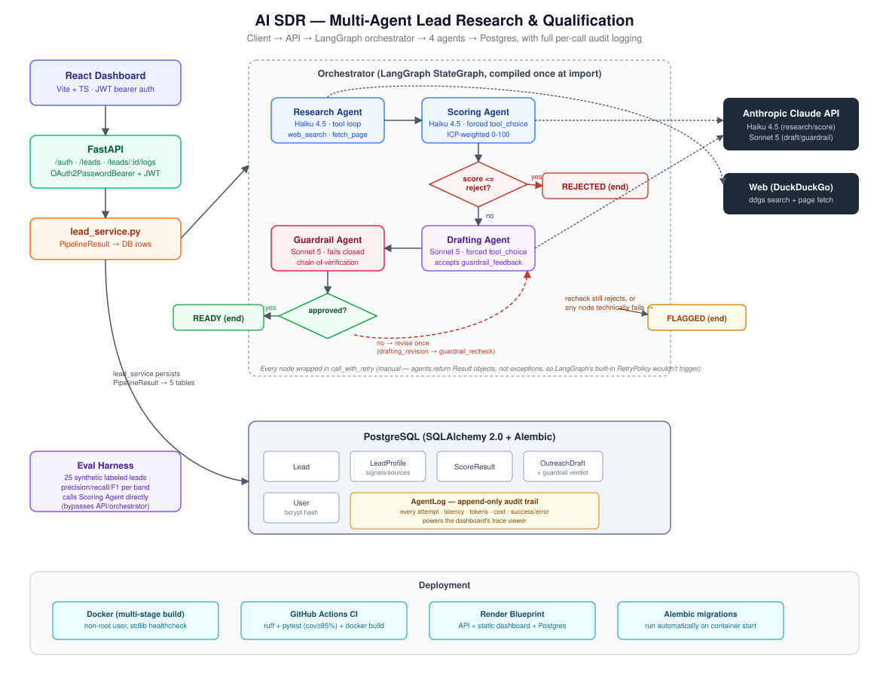

# AI SDR — Multi-Agent Sales Lead Research & Qualification System

A multi-agent system that, given a company name, autonomously researches it, scores it against a configurable Ideal Customer Profile, drafts personalized outreach, and independently fact-checks that draft against the research before anything is marked ready to send — with every agent decision logged for full traceability.

Not a chatbot wrapper: a pipeline with a fail-closed guardrail, an audit trail, and an evaluation harness.

> Replace `<your-github-username>` below once this repo is pushed to GitHub, so the CI badge and links resolve.

[](https://github.com/<your-github-username>/AI-SDR-Architecture/actions/workflows/ci.yml)

**Live demo:** deploy via [`render.yaml`](render.yaml) — see [`docs/deployment.md`](docs/deployment.md) — then link it here.

## What it does

1. **Research Agent** (`gemini-2.5-flash` via Google Gemini) — an agentic tool-calling loop (`web_search`, `fetch_page`) that gathers signals about a company: funding, hiring, product positioning.

2. **Scoring Agent** (`gemini-2.5-flash` via Google Gemini) — scores the research 0-100 against a weighted, YAML-configured ICP (currently: AI-native B2B companies). Below the reject threshold, the pipeline stops here — no wasted spend on drafting outreach to a bad-fit lead.

3. **Drafting Agent** (`gemini-2.5-flash` via Google Gemini) — writes a personalized outreach message grounded in the research.

4. **Guardrail Agent** (`gemini-2.5-flash` via Google Gemini) — independently fact-checks the draft against the research using a chain-of-verification pattern, and **fails closed**: if the guardrail check itself errors out, the draft is never auto-approved. One revision loop back through Drafting before a lead is flagged for human review.

Every agent call — including failed attempts and retries — is written to an append-only `AgentLog` table (agent, model, latency, tokens, cost, success/error), which the dashboard's trace viewer renders per lead.



## Key engineering decisions

A few choices worth calling out (full reasoning in [`docs/architecture.md`](docs/architecture.md)):

* **Task-specific model configuration** — the application separates the model configuration for research/scoring from drafting/guardrail through dedicated settings. The current deployment uses `gemini-2.5-flash` for both groups. This keeps the architecture ready for model specialization without coupling individual agents to a provider-specific implementation.

* **Cost-aware execution** — `src/core/pricing.py` provides optional model pricing estimates for AgentLog and evaluation reports. Unknown or unverified model pricing is represented as `None` rather than incorrectly reporting zero cost.

* **Fail-closed guardrail** — an LLM outage during the fact-check step results in a flagged lead, never a silently-approved one.

* **Hand-rolled orchestrator first, LangGraph second** — the pipeline was built as an explicit state machine before being refactored onto LangGraph, specifically so the low-level tool-calling and state-transition logic wasn't hidden behind a framework from day one. Both versions exist side by side; see [`docs/milestone10-langgraph-refactor.md`](docs/milestone10-langgraph-refactor.md) for the before/after comparison, including the finding that the LangGraph version is **more** lines of code, not fewer.

* **Manual retries, not LangGraph's `RetryPolicy`** — agents return `Result` objects (`success: bool`) rather than raising exceptions on failure, so a native retry-on-exception policy would never trigger. `call_with_retry` wraps every node instead.

* **Dialect-generic SQLAlchemy types** — `Uuid`, not `postgresql.dialects.UUID`, so the full test suite runs against in-memory SQLite without needing a real Postgres instance for unit tests.

* **Synchronous pipeline execution** — `POST /leads` blocks until all four agents finish (documented tradeoff, not an oversight — see Future Improvements). Fine for a single-user demo; a background task queue is the obvious next step under concurrent load.

## Tech stack

| Layer               | Choice                                                                            |
| ------------------- | --------------------------------------------------------------------------------- |
| Backend API         | FastAPI, JWT auth (OAuth2PasswordBearer)                                          |
| Agent orchestration | LangGraph `StateGraph` (hand-rolled version preserved as reference)               |
| LLM                 | Google Gemini via OpenAI-compatible API                                           |
| Models              | `gemini-2.5-flash` for research/scoring and drafting/guardrail                    |
| Database            | PostgreSQL via SQLAlchemy 2.0 + Alembic                                           |
| Frontend            | React + Vite + TypeScript, `react-router-dom`                                     |
| Testing             | pytest, mocked LLM/tool responses, 96%+ coverage                                  |
| CI/CD               | GitHub Actions — lint, test, then a real Docker build + smoke test                |
| Containerization    | Docker (multi-stage, non-root) + docker-compose                                   |
| Deployment          | Render Blueprint (`render.yaml`) — see [`docs/deployment.md`](docs/deployment.md) |

Full rationale for every choice in [`docs/architecture.md`](docs/architecture.md) §4.

## Local development

Backend:

```bash
pip install -e ".[dev]"
```

Create your local `.env` from `.env.example` and add your real Gemini API key:

```env
JWT_SECRET_KEY=your_real_jwt_secret
GEMINI_API_KEY=your_real_gemini_api_key
```

**Never commit `.env` or expose API keys in the frontend.**

Then run:

```bash
alembic upgrade head
uvicorn src.main:app --reload
```

Frontend dashboard (separate terminal):

```bash
cd frontend
npm install
```

Create the frontend `.env` from its example file and point it at the backend:

```bash
npm run dev
```

Open `http://localhost:5173`, register an account, and research a lead.

See [`docs/demo.md`](docs/demo.md) for a full walkthrough.

## Testing and evaluation

```bash
pytest --cov=src --cov-report=term-missing
ruff check src tests
python -m src.eval.run_eval
```

The eval harness (`src/eval/run_eval.py`) reports precision/recall/F1 per score band (reject/review/ready), agreement rate, mean latency, and total estimated cost against `data/eval/ai_native_b2b_eval_set.yaml` — 25 fictional companies, deliberately synthetic rather than scraped real ones, so the eval is reproducible and isolates Scoring Agent quality from Research Agent/web variability.

The evaluation harness requires a configured `GEMINI_API_KEY` because it calls the Scoring Agent directly. It should be run locally with a valid Gemini API key.

Cost estimates are reported only when pricing for the configured model has been verified and configured in `src/core/pricing.py`.

## Docker

```bash
docker compose -f docker/docker-compose.yml up --build
```

The Gemini API key must be supplied through the application's environment configuration. Do not place the actual key in `docker-compose.yml`, `render.yaml`, source code, or GitHub.

## Project structure

```text
AI-SDR-Architecture/

├── src/
│   ├── api/                  # FastAPI routers: auth, leads, health, middleware
│   ├── agents/               # research, scoring, drafting, guardrail + orchestrator
│   ├── tools/                # web_search, page_fetch
│   ├── core/                 # config, security, logging, pricing, ICP loader
│   ├── db/                   # SQLAlchemy models, session
│   ├── schemas/              # Pydantic I/O contracts
│   ├── services/             # lead_service.py — orchestrator -> DB
│   └── eval/                 # evaluation harness
├── frontend/                 # React + Vite + TS dashboard
├── tests/                    # mirrors src/, mocked-LLM unit tests
├── alembic/                  # DB migrations
├── docker/                   # Dockerfile, docker-compose.yml
├── .github/workflows/ci.yml  # lint -> test -> real Docker build+smoke test
├── configs/                  # ICP YAML config
├── data/eval/                # synthetic eval dataset
├── docs/                     # architecture, deployment, demo docs
└── render.yaml               # one-file Render Blueprint
```

## Documentation

* [`docs/architecture.md`](docs/architecture.md) — problem definition, full architecture, tech stack rationale, milestone plan, future improvements
* [`docs/milestone10-langgraph-refactor.md`](docs/milestone10-langgraph-refactor.md) — hand-rolled state machine vs. LangGraph, compared directly
* [`docs/deployment.md`](docs/deployment.md) — Render deployment guide
* [`docs/demo.md`](docs/demo.md) — end-to-end walkthrough
